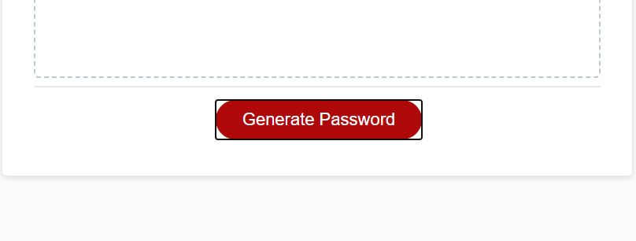
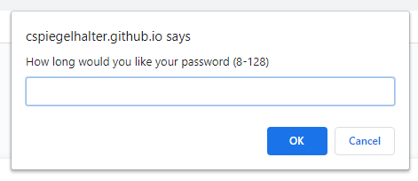
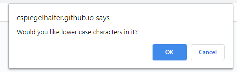
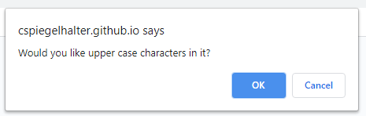
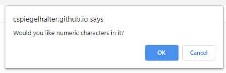
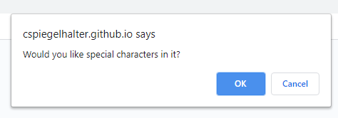
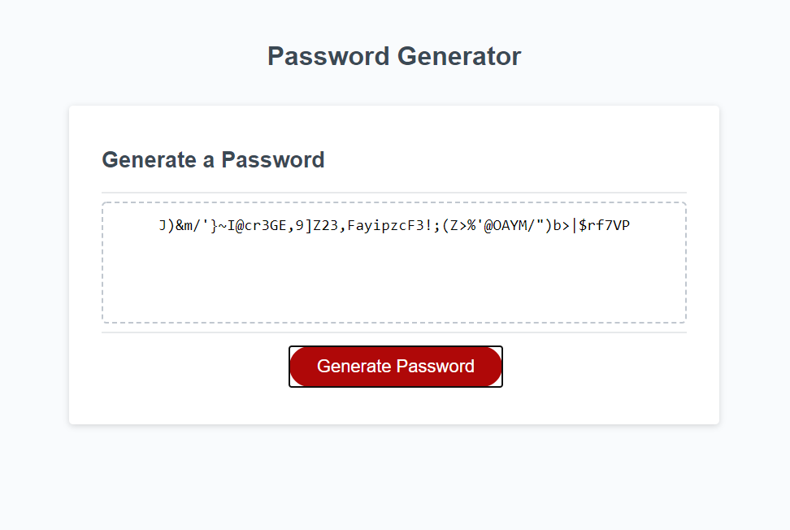

# randomPasswordGen
Generates a random password after prompting you to choose different parameters

# How to play
1. Start the generator by hitting the "Generate Password" button.

    

2. Next you will be asked for your preferred password length. Make sure you input a NUMBER between 8-128 otherwise it will throw a fit!

    

3. Now you will choose what characters to include and which to not include in your password (ex. lower/upper case, numbers, special characters). You must choose at least one of these options!

       

        

4. If you made it this far you should see a beautifully crafted password in the middle of your screen as shown below.

    

    